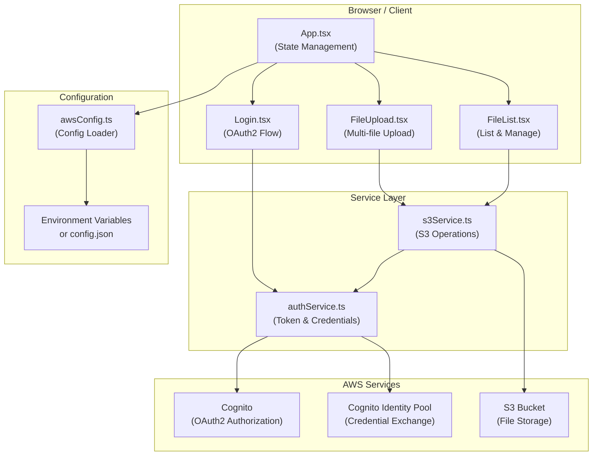
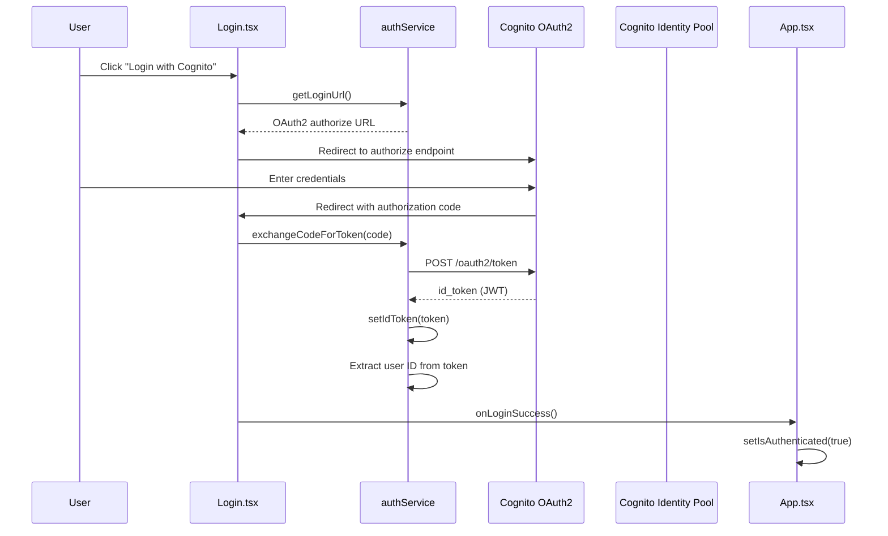
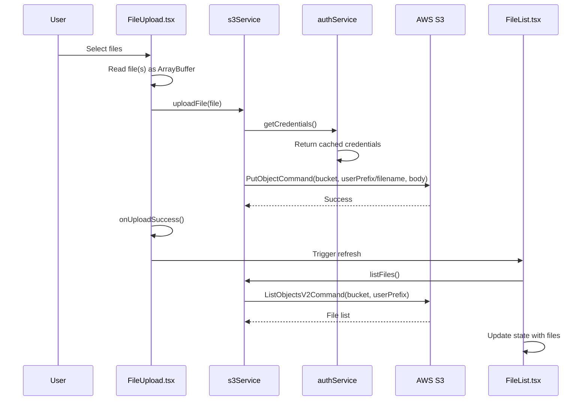
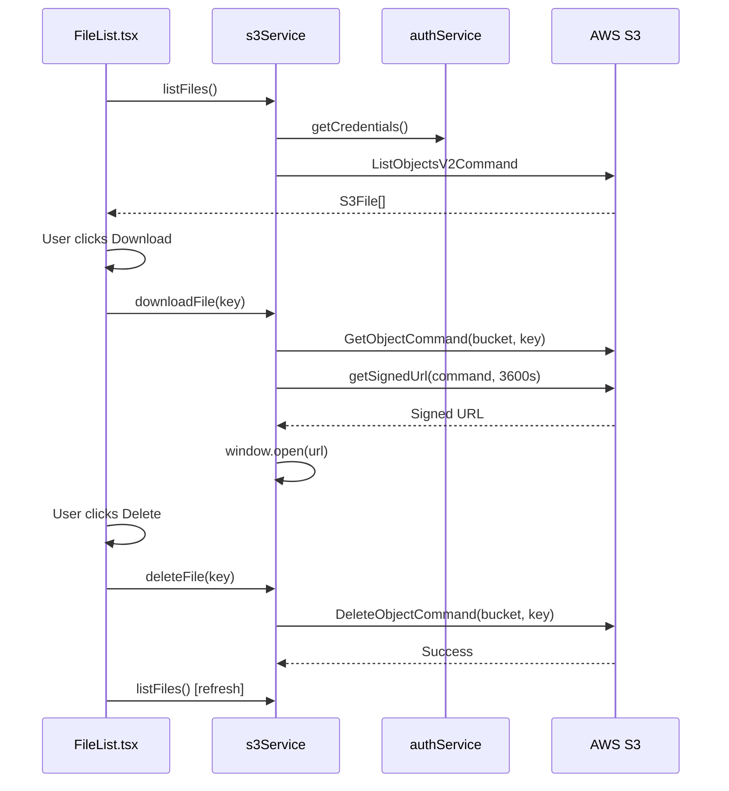
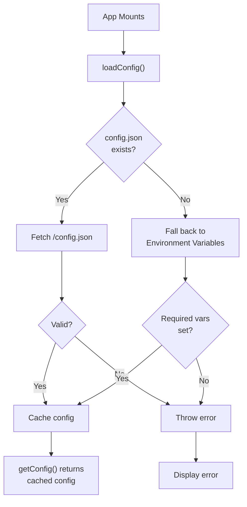

# Design Document: Drive - AWS S3 File Management Application

## Overview

Drive is a React web application that provides secure file management for AWS S3 storage. It combines Cognito Identity Pool authentication with S3 operations to enable users to upload, download, list, and delete files with per-user isolation. The application supports both development and production deployments through environment-based configuration, with signed URLs for time-limited file access and credential caching for optimal performance.

## Architecture

The Drive application follows a layered architecture with clear separation of concerns:

- **Presentation Layer**: React components (App, Login, FileUpload, FileList) handle user interactions and display
- **Service Layer**: Business logic services (authService, s3Service) manage authentication and file operations
- **Configuration Layer**: awsConfig handles environment-based configuration loading
- **External Services**: AWS Cognito for authentication, S3 for storage, Cognito Identity Pool for credentials

## Components and Interfaces

### React Components

**App.tsx** - Main application component
- Manages authentication state
- Loads configuration on mount
- Routes between Login and authenticated views
- Handles logout functionality

**Login.tsx** - Authentication component
- Displays login interface
- Initiates OAuth2 flow
- Handles authorization code exchange
- Displays authentication errors

**FileUpload.tsx** - File upload component
- Displays file input and drag-and-drop zone
- Handles file selection and drag-and-drop events
- Manages upload state and progress
- Displays upload errors

**FileList.tsx** - File management component
- Lists user's files with metadata
- Provides download and delete actions
- Handles file list refresh
- Displays file operations errors

### Service Interfaces

**authService**
- `getLoginUrl()`: Generate OAuth2 authorization URL
- `exchangeCodeForToken(code)`: Exchange authorization code for ID token
- `setIdToken(token)`: Store ID token in memory
- `getCredentials()`: Get AWS credentials (cached or fresh)
- `getUserId()`: Get current user ID from token
- `clearCredentials()`: Clear all authentication state

**s3Service**
- `listFiles()`: List files under user's S3 prefix
- `uploadFile(file)`: Upload file to S3
- `downloadFile(key)`: Generate signed URL and download
- `deleteFile(key)`: Delete file from S3
- `clearS3Client()`: Clear S3 client instance

### Type Definitions

**S3File**
```typescript
interface S3File {
  key: string              // Full S3 key including user prefix
  size: number             // File size in bytes
  lastModified: Date       // Last modification timestamp
}
```

**AWSConfig**
```typescript
interface AWSConfig {
  region: string                    // AWS region
  identityPoolId: string            // Cognito Identity Pool ID
  bucketName: string                // S3 bucket name
  cognitoDomain: string             // Cognito domain
  clientId: string                  // Cognito app client ID
  redirectUri: string               // OAuth2 redirect URI
  userPoolId: string                // Cognito User Pool ID
}
```

## Data Models

### Authentication State
- **ID Token**: JWT token from Cognito containing user identity
- **User ID**: Extracted from token's "sub" claim
- **AWS Credentials**: Temporary credentials from Cognito Identity Pool
- **Credential Expiration**: Timestamp when credentials expire

### File Metadata
- **S3 Key**: Full path including user prefix (e.g., "user-123/filename.txt")
- **File Size**: Size in bytes
- **Last Modified**: ISO timestamp of last modification
- **Display Name**: Filename without user prefix

### Configuration
- **Region**: AWS region for services
- **Identity Pool ID**: For credential exchange
- **Bucket Name**: S3 bucket for file storage
- **Cognito Domain**: For OAuth2 endpoints
- **Client ID**: Application identifier in Cognito
- **Redirect URI**: OAuth2 callback URL
- **User Pool ID**: Cognito User Pool identifier

## System Architecture



## Component Interactions

### Data Flow: Authentication



### Data Flow: File Upload



### Data Flow: File Operations



## Authentication Flow and Credential Management

### OAuth2 Authorization Code Flow

The application implements the OAuth2 Authorization Code flow with Cognito:

1. **Initiation**: User clicks "Login with Cognito" button
2. **Authorization Request**: Redirect to Cognito authorize endpoint with:
   - `client_id`: Application client ID
   - `response_type`: "code"
   - `scope`: "openid email"
   - `redirect_uri`: Application callback URL
3. **User Authentication**: User enters credentials in Cognito-hosted UI
4. **Authorization Grant**: Cognito redirects back with authorization code in URL
5. **Token Exchange**: Application exchanges code for ID token via backend token endpoint
6. **Token Storage**: ID token cached in memory for session duration

### Credential Management

```typescript
// Token Lifecycle
1. ID Token obtained from Cognito OAuth2 flow
2. Token decoded to extract user ID (sub claim)
3. Token cached in memory (cachedIdToken)
4. User ID cached in memory (cachedUserId)

// Credential Exchange
1. When S3 operations needed, getCredentials() called
2. If credentials cached and valid, return cached credentials
3. Otherwise, use Cognito Identity Pool to exchange ID token for AWS credentials
4. Credentials include: AccessKeyId, SecretKey, SessionToken, Expiration
5. Credentials cached for reuse until expiration
6. S3Client created with exchanged credentials
```

### Security Considerations

- **Token Storage**: ID tokens stored in memory only (cleared on logout)
- **No Persistent Storage**: Tokens not persisted to localStorage/sessionStorage
- **Session Scope**: Credentials valid only for current browser session
- **Credential Expiration**: AWS credentials have built-in expiration (typically 1 hour)
- **User Isolation**: S3 prefix-based isolation ensures users can only access their own files

## File Operation Workflows

### List Files Workflow

```
Preconditions:
  - User is authenticated
  - S3 bucket exists and is accessible
  - User has ListObjects permission on bucket

Steps:
  1. Get user ID from cached token
  2. Construct S3 prefix: "{userId}/"
  3. Call ListObjectsV2Command with bucket and prefix
  4. Map S3 objects to S3File interface
  5. Return file list to component

Postconditions:
  - Returns array of S3File objects
  - Each file contains: key, size, lastModified
  - Only files under user's prefix returned
  - Empty array if no files exist

Error Cases:
  - Not authenticated: Throw "Not authenticated"
  - S3 access denied: Throw S3 error message
  - Network failure: Throw network error
```

### Upload File Workflow

```
Preconditions:
  - User is authenticated
  - File object provided with name, type, content
  - S3 bucket exists and is writable
  - User has PutObject permission

Steps:
  1. Get user ID from cached token
  2. Construct S3 key: "{userId}/{filename}"
  3. Read file as ArrayBuffer
  4. Call PutObjectCommand with:
     - Bucket: configured bucket name
     - Key: user-prefixed filename
     - Body: file content as Uint8Array
     - ContentType: file MIME type
  5. Wait for S3 confirmation

Postconditions:
  - File stored in S3 under user's prefix
  - File accessible via S3 API
  - Component notified of success
  - File list refreshed

Error Cases:
  - Not authenticated: Throw "Not authenticated"
  - File read error: Throw file read error
  - S3 access denied: Throw S3 error message
  - Network failure: Throw network error
  - File too large: Throw size error (if applicable)
```

### Download File Workflow

```
Preconditions:
  - User is authenticated
  - File key provided
  - File exists in S3
  - User has GetObject permission

Steps:
  1. Get user ID from cached token
  2. Create GetObjectCommand with bucket and key
  3. Generate signed URL valid for 3600 seconds (1 hour)
  4. Open signed URL in new browser tab
  5. Browser downloads file directly from S3

Postconditions:
  - Signed URL generated and valid for 1 hour
  - File downloaded to user's default download location
  - No file content passed through application server

Error Cases:
  - Not authenticated: Throw "Not authenticated"
  - File not found: Throw S3 error
  - S3 access denied: Throw S3 error message
  - Network failure: Throw network error
```

### Delete File Workflow

```
Preconditions:
  - User is authenticated
  - File key provided
  - File exists in S3
  - User has DeleteObject permission

Steps:
  1. Get user confirmation from user
  2. Get user ID from cached token
  3. Call DeleteObjectCommand with bucket and key
  4. Wait for S3 confirmation
  5. Refresh file list

Postconditions:
  - File removed from S3
  - File no longer appears in file list
  - Component state updated

Error Cases:
  - User cancels deletion: No action taken
  - Not authenticated: Throw "Not authenticated"
  - File not found: S3 returns success (idempotent)
  - S3 access denied: Throw S3 error message
  - Network failure: Throw network error
```

## Configuration Management Strategy

### Configuration Loading Process



### Configuration Sources

**Development Environment**:
- Source: `.env.local` file (not committed)
- Variables:
  - `VITE_AWS_REGION`: AWS region (e.g., "us-east-1")
  - `VITE_COGNITO_IDENTITY_POOL_ID`: Cognito Identity Pool ID
  - `VITE_S3_BUCKET_NAME`: S3 bucket name
  - `VITE_COGNITO_DOMAIN`: Cognito domain
  - `VITE_CLIENT_ID`: Cognito app client ID
  - `VITE_REDIRECT_URI`: OAuth2 redirect URI
  - `VITE_USER_POOL_ID`: Cognito User Pool ID
- Access: `import.meta.env.VITE_*`

**Production Environment**:
- Source: `public/config.json` (loaded at runtime)
- Format: JSON object matching AWSConfig interface
- Deployment: Created during deployment process
- Access: Fetched via `fetch('/config.json')`

### Configuration Fallback Strategy

1. Try to load `public/config.json` with 2-second timeout
2. If successful and valid, use it
3. If not found or timeout, fall back to environment variables
4. If environment variables incomplete, throw error with instructions
5. Cache configuration for application lifetime

### AWSConfig Interface

```typescript
interface AWSConfig {
  region: string                    // AWS region (e.g., "us-east-1")
  identityPoolId: string            // Cognito Identity Pool ID
  bucketName: string                // S3 bucket name
  cognitoDomain: string             // Cognito domain (e.g., "example.auth.us-east-1.amazoncognito.com")
  clientId: string                  // Cognito app client ID
  redirectUri: string               // OAuth2 redirect URI (e.g., "https://example.com/callback")
  userPoolId: string                // Cognito User Pool ID (e.g., "us-east-1_abc123")
}
```

## Type System and Interfaces

### Core Types

```typescript
// File representation from S3
interface S3File {
  key: string              // Full S3 key including user prefix
  size: number             // File size in bytes
  lastModified: Date       // Last modification timestamp
}

// AWS configuration
interface AWSConfig {
  region: string
  identityPoolId: string
  bucketName: string
  cognitoDomain: string
  clientId: string
  redirectUri: string
  userPoolId: string
}

// Authentication state
interface AuthState {
  isAuthenticated: boolean
  user: CognitoUser | null
  loading: boolean
  error: string | null
}

// Cognito user information
interface CognitoUser {
  username: string
  email?: string
}
```

### Component Props

```typescript
// Login component
interface LoginProps {
  onLoginSuccess: () => void
}

// FileUpload component
interface FileUploadProps {
  onUploadSuccess: () => void
}

// FileList component
interface FileListProps {
  refreshTrigger: number
}
```

## Error Handling and Edge Cases

### Authentication Errors

| Error | Cause | Handling |
|-------|-------|----------|
| "Invalid token format" | Malformed JWT token | Log error, prompt re-login |
| "Failed to exchange code for token" | Cognito token endpoint error | Display error message, retry login |
| "Not authenticated" | Accessing service without token | Redirect to login |
| Network timeout | Cognito unreachable | Retry with exponential backoff |

### S3 Operation Errors

| Error | Cause | Handling |
|-------|-------|----------|
| "Not authenticated" | No valid credentials | Redirect to login |
| "Access Denied" | Insufficient IAM permissions | Display error, check IAM policy |
| "NoSuchKey" | File doesn't exist | Handle gracefully, refresh list |
| "NoSuchBucket" | Bucket doesn't exist | Display configuration error |
| Network timeout | S3 unreachable | Retry operation |

### Configuration Errors

| Error | Cause | Handling |
|-------|-------|----------|
| "Missing required AWS configuration" | Incomplete config.json or env vars | Display error with instructions |
| "Failed to load AWS configuration" | Network error fetching config.json | Retry with fallback to env vars |
| Invalid JSON in config.json | Malformed JSON | Display parse error |

### Edge Cases

**Empty File List**:
- Handled: Display "No files uploaded yet" message
- User can still upload files

**Large File Upload**:
- Handled: File read as ArrayBuffer, sent to S3
- S3 multipart upload handled by SDK for large files
- No client-side size limit enforced

**Concurrent Operations**:
- Upload while listing: Possible race condition
- Mitigation: Refresh triggered after upload completes
- User sees eventual consistency

**Session Expiration**:
- Credentials expire after ~1 hour
- Handled: getCredentials() will fail, user redirected to login
- No automatic token refresh implemented

**Browser Tab Closure**:
- All credentials cleared from memory
- User must re-authenticate on next visit
- No persistent session storage

**Network Disconnection**:
- S3 operations fail with network error
- Error displayed to user
- User can retry when connection restored

## Security Considerations

### Authentication Security

- **OAuth2 Flow**: Uses industry-standard OAuth2 authorization code flow
- **Token Validation**: ID tokens validated by Cognito (signature verification)
- **No Client Secret**: Public client (no secret stored in browser)
- **HTTPS Required**: All communication encrypted in transit
- **CORS**: S3 operations use AWS SDK (no direct CORS calls)

### Credential Security

- **Temporary Credentials**: AWS credentials obtained via Cognito Identity Pool
- **Session Token**: Credentials include session token for additional security
- **Expiration**: Credentials expire automatically (typically 1 hour)
- **No Persistence**: Credentials stored in memory only, cleared on logout
- **No Logging**: Credentials never logged or exposed in console

### Data Security

- **User Isolation**: S3 prefix-based isolation prevents cross-user access
- **Signed URLs**: Download URLs expire after 1 hour
- **Encryption in Transit**: All S3 operations use HTTPS
- **Encryption at Rest**: S3 bucket encryption configured separately
- **No Sensitive Data in URLs**: File keys don't contain sensitive information

### Application Security

- **Strict TypeScript**: Type safety prevents many common vulnerabilities
- **Input Validation**: File names validated by S3 (no path traversal possible)
- **XSS Prevention**: React escapes all user-provided content
- **CSRF Protection**: OAuth2 flow includes state parameter (handled by Cognito)
- **No Eval**: No dynamic code execution

### Deployment Security

- **Environment Variables**: Secrets not committed to repository
- **Config File**: Production config.json created at deployment time
- **HTTPS Enforcement**: Dev server uses HTTPS via basicSsl plugin
- **CSP Headers**: Should be configured at deployment (not in app)
- **CORS Policy**: S3 bucket CORS policy configured separately

## Testing Strategy

### Unit Testing Approach

**authService Tests**:
- Token decoding: Valid/invalid JWT formats
- Token caching: Credentials cached and reused
- User ID extraction: Correct sub claim extraction
- Authentication state: isAuthenticated() returns correct value
- Logout: clearCredentials() clears all state

**s3Service Tests**:
- File listing: Correct prefix construction, response mapping
- File upload: File read, S3 command construction
- File download: Signed URL generation, expiration
- File deletion: Correct key handling, refresh trigger
- Error handling: Proper error propagation

**Component Tests**:
- Login: OAuth2 URL generation, code exchange flow
- FileUpload: File selection, upload state, error display
- FileList: File rendering, action buttons, refresh logic
- App: Config loading, auth state management, routing

### Property-Based Testing Approach

**Property Test Library**: fast-check

**Properties to Test**:

1. **User Isolation Property**:
   - For any two different user IDs, their S3 prefixes are different
   - Files uploaded by user A cannot be listed by user B
   - Property: `∀ userA, userB: userA ≠ userB ⟹ prefix(userA) ≠ prefix(userB)`

2. **File Consistency Property**:
   - After uploading a file, listing files includes that file
   - After deleting a file, listing files excludes that file
   - Property: `upload(file) ⟹ file ∈ listFiles()`

3. **Credential Caching Property**:
   - Multiple calls to getCredentials() return same credentials
   - Credentials remain valid for duration of session
   - Property: `getCredentials() = getCredentials()`

4. **Token Decoding Property**:
   - Valid JWT tokens decode without error
   - Invalid JWT tokens throw error
   - Decoded token contains expected claims
   - Property: `isValidJWT(token) ⟹ decode(token) ≠ error`

5. **Configuration Loading Property**:
   - Configuration loaded exactly once (cached)
   - getConfig() always returns same object
   - Property: `loadConfig() ⟹ getConfig() = getConfig()`

### Integration Testing Approach

**End-to-End Flows**:
1. Login → Upload → List → Download → Delete → Logout
2. Login → List (empty) → Upload multiple → List (all present)
3. Login → Upload → Logout → Login → List (files persist)
4. Error scenarios: Network failure, invalid credentials, S3 errors

**Test Environment**:
- Mock AWS services or use LocalStack
- Test with real Cognito sandbox environment
- Verify S3 bucket permissions and isolation

## Performance Considerations

### Credential Caching

- **Impact**: Eliminates repeated Cognito Identity Pool calls
- **Strategy**: Cache credentials in memory until expiration
- **Benefit**: Faster S3 operations after first authentication
- **Tradeoff**: Memory usage for credential storage

### S3 Client Reuse

- **Impact**: Eliminates repeated S3Client instantiation
- **Strategy**: Create S3Client once, reuse for all operations
- **Benefit**: Reduced initialization overhead
- **Tradeoff**: Client must be recreated if credentials expire

### File List Pagination

- **Current**: No pagination implemented
- **Limitation**: All files loaded at once
- **Recommendation**: Implement pagination for large file counts
- **Implementation**: Use ListObjectsV2 ContinuationToken

### Signed URL Generation

- **Impact**: Minimal overhead (local operation)
- **Strategy**: Generate on-demand for each download
- **Benefit**: URLs expire automatically (security)
- **Tradeoff**: Cannot pre-generate URLs for all files

### Network Optimization

- **Compression**: Vite build includes gzip compression
- **Code Splitting**: React components lazy-loaded by Vite
- **Asset Optimization**: Images and CSS minified
- **Bundle Size**: AWS SDK v3 tree-shaking reduces bundle

## Dependencies

### Runtime Dependencies

- **react** (^18.2.0): UI framework
- **react-dom** (^18.2.0): React DOM rendering
- **@aws-sdk/client-s3** (^3.500.0): S3 operations
- **@aws-sdk/s3-request-presigner** (^3.500.0): Signed URL generation
- **@aws-sdk/client-cognito-identity** (^3.500.0): Cognito Identity client
- **@aws-sdk/credential-provider-cognito-identity** (^3.500.0): Credential provider

### Development Dependencies

- **typescript** (^5.3.0): Type checking
- **vite** (^5.0.0): Build tool
- **@vitejs/plugin-react** (^4.2.0): React support
- **@vitejs/plugin-basic-ssl** (^1.0.0): HTTPS for dev
- **@types/react** (^18.2.0): React types
- **@types/react-dom** (^18.2.0): React DOM types
- **@types/node** (^20.0.0): Node.js types

### External Services

- **AWS Cognito**: Authentication and authorization
- **AWS S3**: File storage
- **AWS Cognito Identity Pool**: Credential exchange

## Correctness Properties

### Property 1: Valid Authentication - Validates: Requirement 1.5, 1.6
```
∀ code ∈ AuthorizationCode:
  exchangeCodeForToken(code) ⟹ isAuthenticated() = true
```

### Property 2: User Identity Consistency - Validates: Requirement 2.5, 2.7
```
∀ token ∈ IDToken:
  setIdToken(token) ⟹ getUserId() = decode(token).sub
```

### Property 3: Credential Validity - Validates: Requirement 3.1, 3.7
```
∀ credentials ∈ AWSCredentials:
  getCredentials() ⟹ credentials.AccessKeyId ≠ ∅ ∧ credentials.SecretKey ≠ ∅
```

### Property 4: User Isolation - Validates: Requirement 23.1, 23.2, 23.3, 23.4, 23.5, 23.6
```
∀ userA, userB ∈ User, userA ≠ userB:
  files_userA = listFiles(userA) ∧ files_userB = listFiles(userB)
  ⟹ files_userA ∩ files_userB = ∅
```

### Property 5: Upload Consistency - Validates: Requirement 6.4, 26.1
```
∀ file ∈ File:
  uploadFile(file) ⟹ file ∈ listFiles()
```

### Property 6: Delete Idempotency - Validates: Requirement 8.7
```
∀ key ∈ S3Key:
  deleteFile(key) ⟹ deleteFile(key) [no error on second call]
```

### Property 7: Download Accessibility - Validates: Requirement 24.1
```
∀ key ∈ S3Key:
  downloadFile(key) ⟹ signedUrl.expiresIn = 3600
```

### Property 8: Configuration Consistency - Validates: Requirement 9.7
```
∀ config ∈ AWSConfig:
  loadConfig() ⟹ getConfig() = getConfig() [idempotent]
```

### Property 9: Configuration Completeness - Validates: Requirement 11.1, 11.2, 11.3, 11.4, 11.5, 11.6, 11.7
```
∀ config ∈ AWSConfig:
  config.region ≠ ∅ ∧ config.identityPoolId ≠ ∅ ∧ config.bucketName ≠ ∅
```

### Property 10: Drag and Drop Upload Consistency - Validates: Requirement 31.4, 31.5, 31.6, 31.7
```
∀ files ∈ File[]:
  dropFiles(files) ⟹ ∀ file ∈ files: file ∈ listFiles()
```

### Property 11: Drag and Drop Event Prevention - Validates: Requirement 31.11, 31.12
```
∀ event ∈ DragEvent:
  dragover(event) ⟹ event.preventDefault() ∧ event.stopPropagation()
  drop(event) ⟹ event.preventDefault() ∧ event.stopPropagation()
```

### Property 12: Drag and Drop File Filtering - Validates: Requirement 31.14
```
∀ items ∈ DataTransferItemList:
  dropFiles(items) ⟹ ∀ item ∈ items: item.kind = "file"
```

## Implementation Notes

### Key Design Decisions

1. **In-Memory Credential Caching**: Improves performance but requires re-authentication on page reload
2. **OAuth2 Authorization Code Flow**: Standard flow with Cognito, no client secret needed
3. **S3 Prefix-Based Isolation**: Simple, scalable approach to user isolation
4. **Signed URLs for Downloads**: Avoids proxying file content through application
5. **Functional Components with Hooks**: Modern React patterns, easier to test
6. **Service Layer Abstraction**: Separates business logic from UI components
7. **Environment-Based Configuration**: Supports dev/prod deployments without code changes

### Drag and Drop File Upload Implementation

The drag-and-drop feature enhances the file upload experience by allowing users to drag files directly onto a designated zone:

**Drag and Drop Zone**:
- Displayed in the FileUpload component when user is authenticated
- Provides visual feedback when files are dragged over it (highlight/border change)
- Accepts multiple files in a single drop operation
- Filters out non-file items (folders, text, etc.)

**Event Handling**:
- `dragover`: Highlight zone and prevent default browser behavior
- `dragleave`: Remove highlight when files leave zone
- `drop`: Accept files and initiate upload process
- All events prevent default browser behavior to avoid file opening

**Upload Process**:
- Files dropped on zone are read as ArrayBuffer (same as file picker)
- S3 keys constructed as "{userId}/{filename}" for each file
- Files uploaded sequentially to S3
- Zone disabled during upload with "Uploading..." status
- On success: zone cleared and file list refreshed
- On failure: error message displayed and zone re-enabled

**Integration with Existing Upload**:
- Drag-and-drop and file picker both use same `uploadFile()` service method
- Both trigger same file list refresh on completion
- Both show same upload status and error handling

### Future Enhancements

1. **File Pagination**: Implement pagination for large file counts
2. **Automatic Token Refresh**: Refresh credentials before expiration
3. **Offline Support**: Cache file list and enable offline browsing
4. **File Sharing**: Generate shareable links with expiration
5. **Folder Structure**: Organize files in virtual folders
6. **Search and Filter**: Search files by name, date, size
7. **Batch Operations**: Upload/delete multiple files with progress
8. **File Preview**: Preview images and documents in browser
9. **Mobile Optimization**: Responsive design for mobile devices
